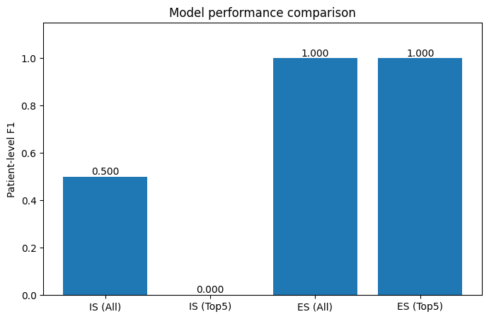
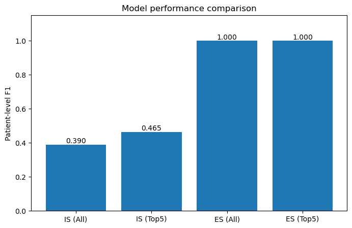
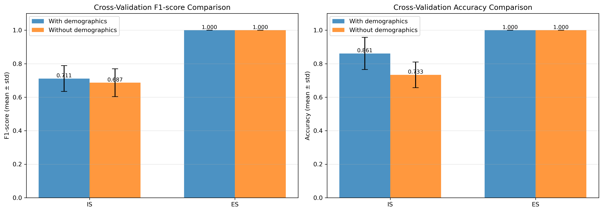
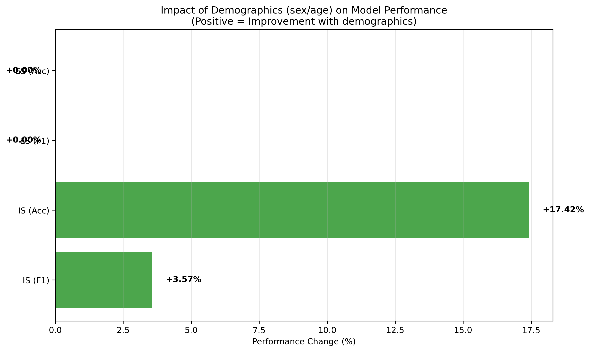
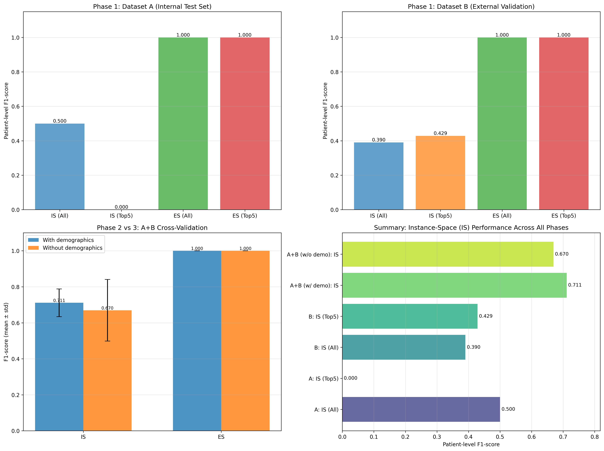
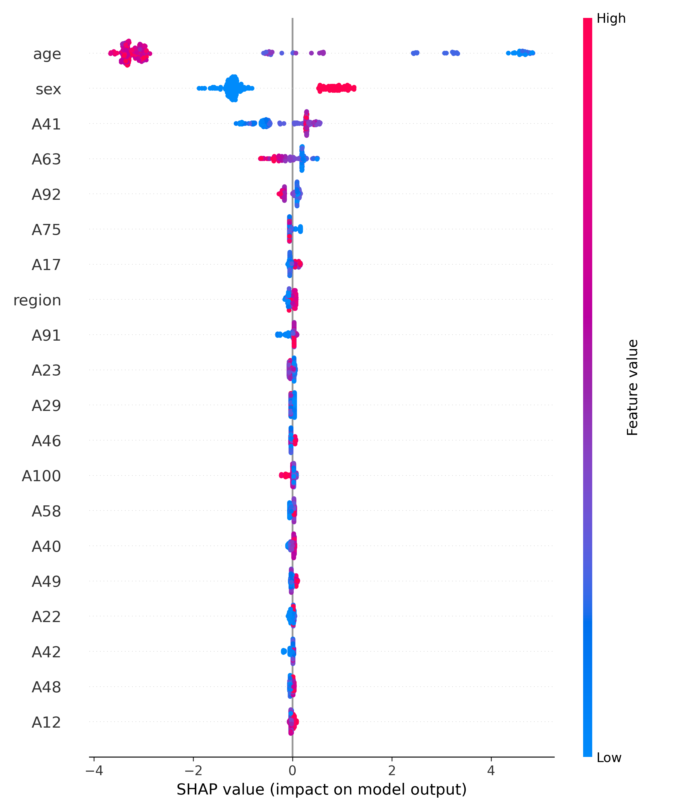
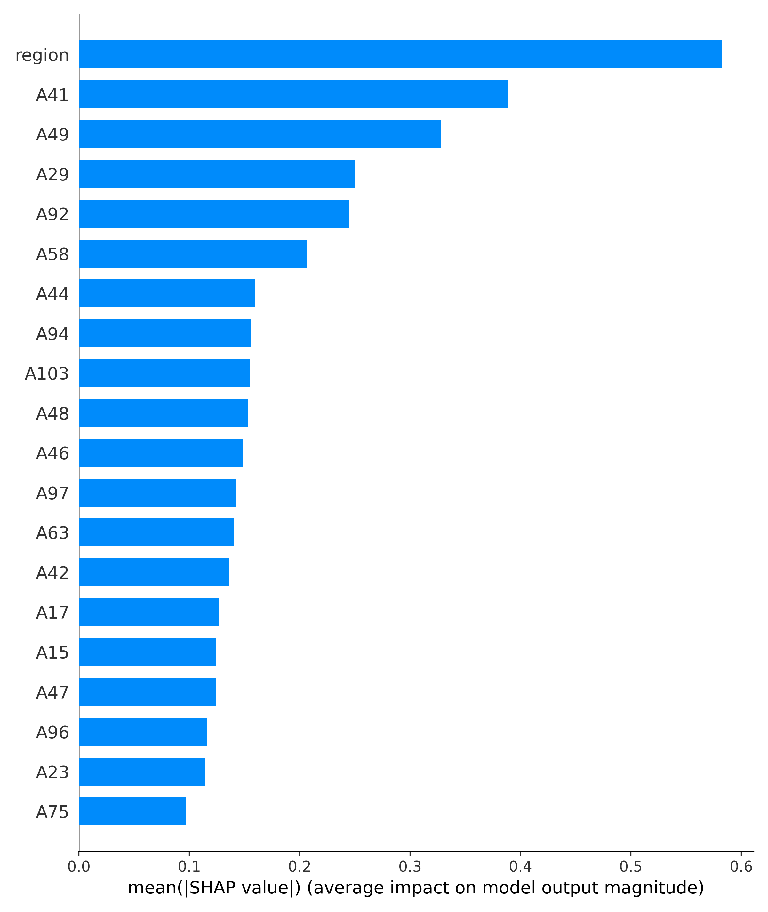

# Lymphoma Classification Project

Machine learning pipeline for classifying Hodgkin Lymphoma (HL) vs. other lymphomas using medical imaging features with explainable AI (XAI) techniques.

## Project Overview

This project implements and compares two classification approaches:
- **Instance-Space (IS)**: VOI-level predictions aggregated to patient-level
- **Embedded-Space (ES)**: Patient-level features from aggregated VOI statistics

The pipeline includes:
- Internal validation on dataset A
- External validation on dataset B
- Cross-validation with/without demographics (sex, age)
- SHAP-based feature importance analysis
- Comprehensive visualizations

---

## Project Structure

```
ProjectXAI/
├── data/
│   ├── dataset_A.csv          # Internal dataset (with demographics)
│   ├── dataset_B.csv          # External validation dataset
│   └── dataset_A+B.csv        # Combined dataset (without demographics)
├── results/
│   ├── performance_comparison_A.png
│   ├── performance_comparison_B.png
│   ├── cv_demographics_comparison.png
│   ├── demographics_impact.png
│   ├── all_phases_comparison.png
│   ├── IS_summary.png
│   ├── IS_bar.png
│   └── summary_complete.json
├── config.py                  # Configuration parameters
├── data_utils.py             # Data loading and preprocessing
├── model_IS.py               # Instance-Space models
├── model_ES.py               # Embedded-Space models
├── shap_utils.py             # SHAP explainability
├── evaluation.py             # Metrics and evaluation
├── visualization_utils.py    # Plotting functions
├── main.py                   # Main pipeline
├── requirements.txt          # Python dependencies
└── README.md                 # This file
```

---

## Installation

### 1. Clone the repository
```bash
git clone <repository-url>
cd ProjectXAI
```

### 2. Create a virtual environment (recommended)
```bash
# Using conda
conda create -n lymphoma python=3.10
conda activate lymphoma

# Or using venv
python -m venv venv
source venv/bin/activate  # On Windows: venv\Scripts\activate
```

### 3. Install dependencies
```bash
pip install -r requirements.txt
```

**Note**: If you encounter NumPy 2.x compatibility issues, run:
```bash
pip install "numpy<2.0"
```

---

## Configuration

Edit `config.py` to customize experimental parameters:

```python
# Data split parameters
TEST_SIZE = 0.3          # Train/test split ratio
N_SPLITS = 3             # Number of CV folds
RANDOM_STATE = 42        # Random seed

# Dataset paths
DATASET_A_PATH = "data/dataset_A.csv"
DATASET_B_PATH = "data/dataset_B.csv"
DATASET_AB_PATH = "data/dataset_A+B.csv"

# Feature selection
EXCLUDE_FEATURES = ["sex", "age"]  # Demographics to exclude
TOP_K_FEATURES = 5                 # Top SHAP features to use

# Merge strategy for Phase 2
MERGE_STRATEGY = "common_patients"  # Options: "common_patients", "fill_missing", "drop_demographics"
```

### Merge Strategies

- **`common_patients`** (Recommended): Uses only patients present in both datasets, copying demographics from A to B
- **`fill_missing`**: Fills missing demographics with mean (age) or mode (sex)
- **`drop_demographics`**: Removes demographics from both datasets

---

## Usage

Run the complete pipeline:

```bash
python main.py
```

This executes three experimental phases:

### **Phase 1**: Internal & External Validation
- Train on dataset A (70/30 split)
- Validate internally on dataset A test set
- Validate externally on dataset B
- Compare models: IS (all features), IS (top 5), ES (all features), ES (top 5)

### **Phase 2**: Cross-Validation WITH Demographics
- Merge datasets A and B using configured strategy
- 3-fold cross-validation with sex and age features
- Compare IS vs ES performance

### **Phase 3**: Cross-Validation WITHOUT Demographics
- Load combined dataset A+B.csv
- 3-fold cross-validation excluding sex and age
- Assess impact of demographics on performance

---

## Results Summary

### Dataset A (Internal Test Set)

| Model | VOI Acc | VOI F1 | Patient Acc | Patient F1 |
|-------|---------|--------|-------------|------------|
| IS (All) | 90.0% | 40.0% | **81.8%** | 50.0% |
| IS (Top 5) | 90.0% | 52.6% | **90.9%** | **80.0%** |
| ES (All) | - | - | **100%** ⚠️ | **100%** ⚠️ |
| ES (Top 5) | - | - | **100%** ⚠️ | **100%** ⚠️ |

 **Warning**: Perfect scores may indicate overfitting. See external validation below.

### Dataset B (External Validation)

| Model | VOI Acc | VOI F1 | Patient Acc | Patient F1 |
|-------|---------|--------|-------------|------------|
| IS (All) | 82.2% | 59.1% | **58.3%** | 39.0% |
| IS (Top 5) | 81.7% | 58.5% | **61.7%** | **46.5%** |
| ES (All) | - | - | **100%** ⚠️ | **100%** ⚠️ |
| ES (Top 5) | - | - | **100%** ⚠️ | **100%** ⚠️ |

### Cross-Validation (A+B Combined)

| Model | With Demographics | Without Demographics |
|-------|-------------------|---------------------|
| IS | F1: 71.1% (±7.7%) | F1: 68.7% (±8.3%) |
| ES | F1: 100% (±0%) ⚠️ | F1: 100% (±0%) ⚠️ |

**Key Finding**: Demographics (sex/age) improve IS performance by ~3.5%, but ES shows suspicious perfect scores.

---

## Top 5 Most Important Features (SHAP)

1. **region** - Anatomical region
2. **A41** - Radiomics feature
3. **A49** - Radiomics feature
4. **A29** - Radiomics feature
5. **A92** - Radiomics feature

---

## Visualizations

### 1. Performance Comparison - Dataset A

*Comparison of IS and ES models on internal test set*

### 2. Performance Comparison - Dataset B

*External validation results showing generalization performance*

### 3. Cross-Validation Demographics Comparison

*Impact of including sex/age on F1-score and accuracy*

### 4. Demographics Impact Analysis

*Percentage change in performance with/without demographics*

### 5. All Phases Overview

*Comprehensive comparison across all experimental phases*

### 6. SHAP Feature Importance

*Feature importance and impact on model predictions*


*Feature importance ranking*

---

## Output Files

### Visualizations (7 PNG files)
- `performance_comparison_A.png` - Dataset A results
- `performance_comparison_B.png` - Dataset B results
- `cv_demographics_comparison.png` - CV with/without demographics
- `demographics_impact.png` - Impact analysis
- `all_phases_comparison.png` - Complete overview
- `IS_summary.png` - SHAP feature importance
- `IS_bar.png` - SHAP ranking

### Data Files
- `summary_complete.json` - Complete numerical results

---

## Key Components

### Data Utilities (`data_utils.py`)
- `load_data()` - Load and preprocess CSV data
- `load_data_exclude_features()` - Load data excluding specified features
- `merge_datasets_with_demographics()` - Merge A+B with demographic handling
- `split_by_patient()` - Patient-stratified train/test split
- `align_features()` - Align feature sets across datasets

### Models

#### Instance-Space (`model_IS.py`)
- VOI-level predictions with XGBoost
- Patient-level aggregation via majority voting
- Cross-validation with patient grouping

#### Embedded-Space (`model_ES.py`)
- Patient-level feature aggregation (min, max, mean, std)
- Direct patient-level classification
- Stratified K-fold cross-validation

### Explainability (`shap_utils.py`)
- SHAP TreeExplainer for feature importance
- Summary and bar plots
- Top-K feature selection

---

## Model Details

### XGBoost Configuration
```python
XGBClassifier(
    objective="binary:logistic",
    eval_metric="logloss",
    n_estimators=200,
    learning_rate=0.05,
    max_depth=5,
    subsample=0.8,
    colsample_bytree=0.8,
    random_state=42
)
```

### Cross-Validation Strategy
- **Instance-Space**: StratifiedGroupKFold (maintains patient grouping)
- **Embedded-Space**: StratifiedKFold (patient-level already)
- **Folds**: 3 (configurable)
- **Stratification**: By target class (HL vs Others)

---

## Known Issues & Recommendations

### 1. Embedded-Space Overfitting
**Issue**: ES shows perfect accuracy (100%) on both internal and external validation.

**Possible Causes**:
- Small dataset size relative to feature dimensionality
- Feature aggregation creates too-distinctive patient signatures
- Potential data leakage

**Recommendations**:
- Use IS models for production (more robust)
- Investigate ES feature engineering
- Collect more diverse data
- Consider nested cross-validation

### 2. External Validation Performance Drop
**Issue**: IS accuracy drops from 81.8% (internal) to 58.3% (external).

**Possible Causes**:
- Dataset shift between A and B
- Different patient populations
- Missing features in dataset B

**Recommendations**:
- Top 5 features perform better on external data (61.7% vs 58.3%)
- Feature selection improves generalization
- Focus on robust features (region, A41, A49, A29, A92)

### 3. Demographics Impact
**Observation**: Sex/age improve IS F1 by ~3.5% (71.1% → 68.7%)

**Recommendations**:
- Include demographics when available
- 78 common patients provide good statistical power
- Consider sensitivity analysis with different merge strategies

---

## Troubleshooting

### NumPy Compatibility Error
```bash
# Error: numpy.core.multiarray failed to import
pip uninstall numpy -y
pip install "numpy>=1.24.0,<2.0"
```

### Missing Dependencies
```bash
pip install -r requirements.txt --force-reinstall
```

### SHAP Installation Issues
```bash
# On Windows, may need Visual C++ Build Tools
pip install shap --no-cache-dir
```

### Memory Issues
Reduce dataset size or use sampling:
```python
# In config.py, add:
SAMPLE_SIZE = 1000  # Limit number of VOIs
```

---

## Dependencies

- **numpy** >= 1.24.0, < 2.0
- **pandas** >= 2.0.0
- **scikit-learn** >= 1.3.0
- **xgboost** >= 2.0.0
- **shap** >= 0.43.0
- **matplotlib** >= 3.7.0
- **joblib** >= 1.3.0

---


