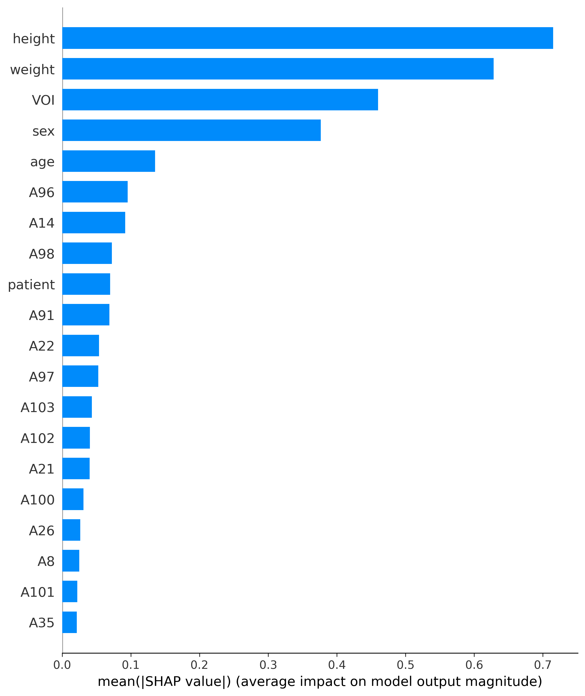
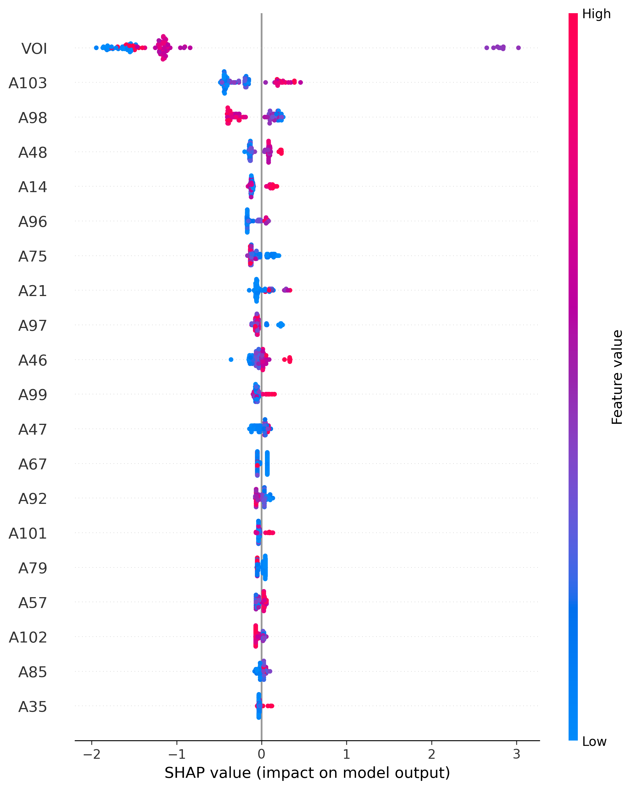
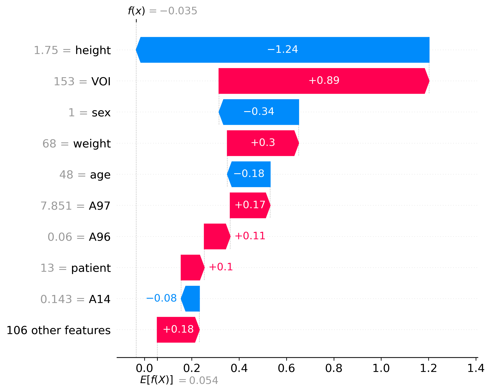

# ProjectXAI

```
project/
│
├── data_utils.py          # Data loading and pre-processing
├── model_utils.py         # Training function, cross-validation and SHAP
├── main.py                # Main script
└── dataset_A.csv
```

## MODEL PERFORMAMCES

```
Fold 1
              precision    recall  f1-score   support

       DLBCL       0.47      0.93      0.62        15
          FL       0.00      0.00      0.00         0
          HL       1.00      1.00      1.00        13
         MCL       1.00      0.50      0.67        32

    accuracy                           0.72        60
   macro avg       0.62      0.61      0.57        60
weighted avg       0.87      0.72      0.73        60


Fold 2
              precision    recall  f1-score   support

       DLBCL       1.00      1.00      1.00        12
          FL       0.23      0.83      0.36         6
          HL       1.00      1.00      1.00         7
         MCL       0.96      0.59      0.73        41

    accuracy                           0.73        66
   macro avg       0.80      0.85      0.77        66
weighted avg       0.90      0.73      0.77        66


Fold 3
              precision    recall  f1-score   support

       DLBCL       1.00      0.47      0.64        17
          FL       0.07      0.10      0.08        21
          HL       1.00      1.00      1.00         1
         MCL       0.07      0.07      0.07        29

    accuracy                           0.19        68
   macro avg       0.53      0.41      0.45        68
weighted avg       0.31      0.19      0.23        68


Fold 4
              precision    recall  f1-score   support

       DLBCL       0.00      0.00      0.00         1
          FL       0.00      0.00      0.00         0
          HL       1.00      0.43      0.60         7
         MCL       0.00      0.00      0.00         6

    accuracy                           0.21        14
   macro avg       0.25      0.11      0.15        14
weighted avg       0.50      0.21      0.30        14


Fold 5
              precision    recall  f1-score   support

       DLBCL       0.00      0.00      0.00         3
          FL       0.00      0.00      0.00        24
          HL       1.00      1.00      1.00        12
         MCL       0.00      0.00      0.00         0

    accuracy                           0.31        39
   macro avg       0.25      0.25      0.25        39
weighted avg       0.31      0.31      0.31        39

Final model trained with 4 classes.

Results on test set:
              precision    recall  f1-score   support

       DLBCL       1.00      0.50      0.67        18
          FL       0.88      0.80      0.84        35
          HL       1.00      1.00      1.00        13
         MCL       0.71      0.94      0.81        36

    accuracy                           0.82       102
   macro avg       0.90      0.81      0.83       102
weighted avg       0.85      0.82      0.82       102
```

## SHAP RESULTS

1. **`shap_bar.png`**: 
   

2. **`shap_summary.png`**:
    

3. **`shap_waterfall.png`**:
    
