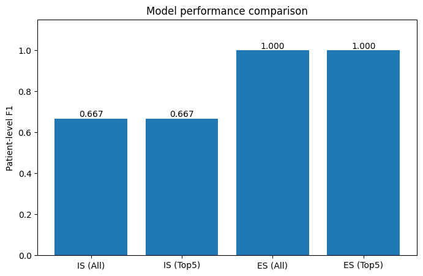

# ProjectXAI: Hodgkin Lymphoma Classification with XAI

A machine learning pipeline for lymphoma classification (Hodgkin Lymphoma vs Others) using two distinct approaches: Instance-Space (IS) and Embedded-Space (ES), with SHAP-based explainability.

## Project Structure

```
project/
│
├── config.py              # Configuration parameters (test size, CV folds, random state)
├── data_utils.py          # Data loading and patient-stratified splitting
├── model_IS.py            # Instance-Space model (VOI-level predictions → patient aggregation)
├── model_ES.py            # Embedded-Space model (patient-level embeddings)
├── shap_utils.py          # SHAP explainability utilities
├── evaluation.py          # Metrics computation and reporting
├── visualization_utils.py # Formatted output and plotting functions
├── main.py                # Main experimental pipeline
├── dataset_A.csv          # Input dataset
└── results/               # Output directory (auto-generated)
    ├── summary.json
    ├── IS_summary.png
    ├── IS_bar.png
    └── performance_comparison.png
```

## Project Overview

### Dataset Characteristics
- **36 patients** with **349 VOIs (Volumes of Interest)**
- **111 radiomic features** per VOI
- **Binary classification**: HL (Hodgkin Lymphoma) vs Others
- **Class imbalance**: 
  - VOI-level: 15.2% HL, 84.8% Others
  - Patient-level: 25.0% HL, 75.0% Others
- **Variable VOIs per patient**: 1-29 (mean: 9.69, median: 8.0)

### Split Strategy
- **Patient-stratified split**: 70% train / 30% test
- Ensures no patient appears in both train and test sets
- Maintains class distribution across splits

## Methodology

### Two Complementary Approaches

#### 1. **Instance-Space (IS)**
- Operates at VOI level
- XGBoost classifier predicts each VOI independently
- Aggregates VOI predictions to patient level via majority voting
- Suitable for fine-grained analysis

#### 2. **Embedded-Space (ES)**
- Aggregates VOI features per patient (min, max, mean, std)
- Creates patient-level embeddings
- Single prediction per patient
- Reduces dimensionality and noise

### Model Configuration
Both approaches use XGBoost with identical hyperparameters:
```python
XGBClassifier(
    objective="binary:logistic",
    n_estimators=200,
    learning_rate=0.05,
    max_depth=5,
    subsample=0.8,
    colsample_bytree=0.8,
    random_state=42
)
```

### Cross-Validation
- **3-fold stratified cross-validation**
- Patient-level stratification with group constraints
- No patient leakage between folds

## Results

### Cross-Validation Performance

#### Instance-Space (IS)
```
Patient-level metrics:
  Accuracy: 0.833 ± 0.068
  F1-score: 0.667 ± 0.000
```

#### Embedded-Space (ES)
```
Patient-level metrics:
  Accuracy: 1.000 ± 0.000
  F1-score: 1.000 ± 0.000
```

### Test Set Evaluation

| Approach | Features | VOI Acc | VOI F1 | Patient Acc | Patient F1 |
|----------|----------|---------|--------|-------------|------------|
| **IS** | All (111) | 0.9333 | 0.7000 | 0.8182 | 0.6667 |
| **IS** | Top 5 | 0.9333 | 0.7000 | 0.8182 | 0.6667 |
| **ES** | All (111) | - | - | **1.0000** | **1.0000** |
| **ES** | Top 5 | - | - | **1.0000** | **1.0000** |

⚠️ **Warning**: Perfect accuracy in ES suggests possible overfitting due to small dataset size (36 patients). Independent validation recommended.

## 🔍 SHAP Explainability

### Top 5 Most Important Features
1. **age** - Patient age
2. **sex** - Patient sex (0=M, 1=F)
3. **A41** - Radiomic feature
4. **A63** - Radiomic feature
5. **A92** - Radiomic feature

### SHAP Visualizations

**Feature Importance Ranking**


**Feature Impact on Predictions**


**Performance Comparison**


### Key Insights
- Using only top 5 features maintains identical performance to full feature set
- Suggests high redundancy in radiomic features
- Age and sex are critical demographic predictors
- Feature selection reduces model complexity without performance loss

## Usage

### Requirements
```bash
pip install pandas numpy scikit-learn xgboost shap matplotlib joblib
```

### Run Full Pipeline
```bash
python main.py
```

### Configuration
Edit `config.py` to modify:
```python
TEST_SIZE = 0.3      # Train/test split ratio
N_SPLITS = 3         # Number of CV folds
RANDOM_STATE = 42    # Reproducibility seed
```

### Output Files
All results are saved to `results/` directory:
- `summary.json` - Numerical results in JSON format
- `IS_summary.png` - SHAP feature impact visualization
- `IS_bar.png` - SHAP feature importance ranking
- `performance_comparison.png` - Model comparison bar plot

## 📈 Performance Comparison

```
Performance ranking (Patient-level F1-score):
  1. Embedded-Space (All features)  : 1.0000  SUSPICIOUS
  2. Embedded-Space (Top 5)         : 1.0000  SUSPICIOUS
  3. Instance-Space (All features)  : 0.6667
  4. Instance-Space (Top 5)         : 0.6667
```

## ⚠️ Limitations 

1. **Small Dataset**: Only 36 patients limits generalization
2. **Overfitting Risk**: Perfect ES accuracy suggests memorization rather than learning
3. **Class Imbalance**: Only 9 HL patients (25%) in dataset
4. **Validation Needed**: Results must be validated on independent external cohort
5. **Feature-to-Sample Ratio**: 111 features for 36 patients is extremely high


## Implementation Details

### Patient-Level Aggregation Strategies

**Instance-Space**: 
- Majority voting on VOI predictions
- Alternative: Mean probability thresholding (implemented but not default)

**Embedded-Space**:
- Statistical aggregation: min, max, mean, std per feature
- Creates 111 × 4 = 444 derived features per patient

### Model Saving
```python
from model_IS import save_model
save_model(model, "results/model_IS.joblib")
```

### SHAP Analysis
```python
from shap_utils import explain_shap, top_shap_features
shap_values = explain_shap(model, X_train, "results/IS")
top_features = top_shap_features(shap_values, feature_names, k=5)
```

